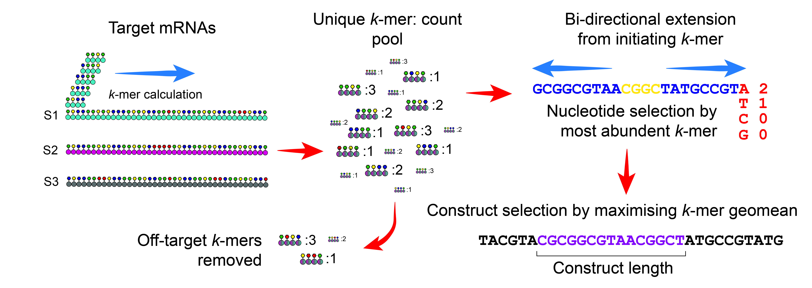

# dsRNAd: a multi-target double-stranded RNA design package for enhanced crop protection

Crop protection is undergoing significant evolution, with a move toward sustainable approaches that do not adversely impact the environment or human health.  RNA interference (RNAi) is being used via application or expression of double-stranded RNA (dsRNA) to target viral, fungal and insect pests and pathogens.  

dsRNAd (dsRNA designer) is a software package using a biologically relevant k-mer based approach for multi-target dsRNA design while mitigating unintended impacts to beneficial organisms.  

Where a specific target is considered a priority, the design algorithm can be biased toward that target.  This package aims to increase the simplicity, efficacy and cost-effectiveness RNAi-based crop protection approaches, aiding translation to market.    



----
# Installation

- Precompiled binaries for Windows, Linux and MacOS (Arm and Intel) can be downloaded from the [Releases page](https://github.com/sfletc/dsRNAd/releases)
- To compile from source, [install Go](https://go.dev/doc/install), clone this repository, and build with ```go build``` - this will generate an executable for the operating system it was built on, with build dependencices downloaded automatically.      

----
# Usage

----
# Troubleshooting

----
# Cite

